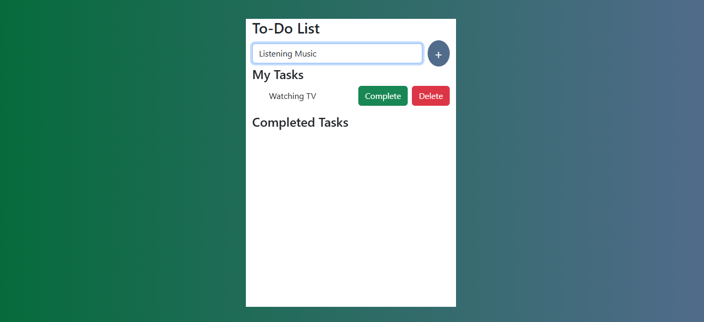
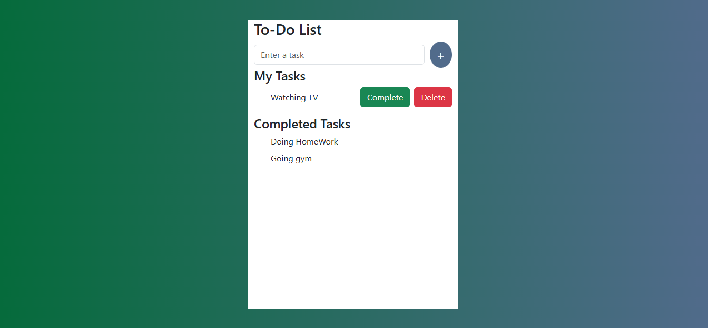

# React To-Do List App

A simple and clean To-Do List application built using React.js.  
This project helps users manage their daily tasks by adding, completing, and deleting tasks.

---

## Features

- Add new tasks
- Delete tasks
- Mark tasks as completed
- Separate sections for:
  - My Tasks
  - Completed Tasks
- Responsive UI using Bootstrap 5
- Clean and minimal design

---

## Tech Stack

- React.js (useState, props)
- JavaScript (ES6+)
- HTML5
- CSS3
- Bootstrap 5

---

## Project Structure
src/
│── App.jsx
│── App.css
│── Task-list.jsx
│── main.jsx

---

## Installation & Setup

Follow these steps to run the project locally:

```bash
# Clone the repository
git clone https://github.com/your-username/todo-list-react.git

# Move into project directory
cd todo-list-react

# Install dependencies
npm install

# Start development server
npm run dev
```
---

## 📸 Screenshots

### Home Page


### Adding a Task


### Completed Tasks


---

---

### **Future Improvements**
Add edit task feature
Store tasks in localStorage
Add due dates and priority levels
Drag and drop tasks
Backend integration with Node.js + MongoDB

---
 
### **Author**
N Padmini Priya

